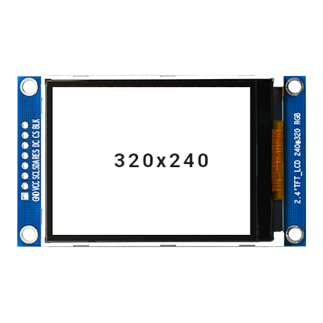

# ZJY240S0800TG02 ILI9341 Device Tree Overlays

Device Tree Overlays for the ZJY240S0800TG02 display with ILI9341 controller, designed for Raspberry Pi. This repository provides production-ready overlays for different physical orientations.

## Display Specifications

- **Model:** ZJY240S0800TG02
- **Controller:** ILI9341
- **Size:** 2.4 inches diagonal
- **Resolution:** 320x240 pixels (QVGA)
- **Interface:** 4-wire SPI
- **Color Depth:** 16-bit RGB565 (BGR order)
- **Max SPI Speed:** 64 MHz

## Why Separate Overlays?

This display requires four separate overlay files instead of one parameterized overlay due to technical limitations:

**The Issue:**
- This display needs custom MADCTL (Memory Access Control) values in the initialization sequence
- Each physical orientation requires a different MADCTL value (0x88, 0xe8, 0x48, 0x28)
- The MADCTL value is hardcoded in the `init` sequence of the overlay
- Device tree overlay parameters cannot modify the init sequence
- The driver's built-in `rotate` parameter does not produce correct results for this display

**The Solution:**
- Four separate overlays, each with the correct init sequence for its orientation
- Simple, reliable, and tested
- No conditional logic or complex parameter handling needed

**Alternative Considered:**
A single overlay with conditional fragments was attempted but proved unreliable due to device tree overlay parameter limitations.

## Overlays Included

### OEM Product Overlay

**raspdac-mini-lcd.dtbo**
- Specific to Audiophonics RASPDAC MINI LCD product
- Landscape orientation (320x240), connector pins on RIGHT
- Fixed configuration, no parameters
- Usage: `dtoverlay=raspdac-mini-lcd`

### Generic Orientation Overlays

Four separate overlays for different physical mounting positions:

**ili9341-zjy240-pins-bottom.dtbo**
- Portrait: 240x320
- MADCTL: 0x88
- Connector position: BOTTOM
- Usage: `dtoverlay=ili9341-zjy240-pins-bottom`

**ili9341-zjy240-pins-right.dtbo**
- Landscape: 320x240  
- MADCTL: 0xe8
- Connector position: RIGHT (same as RASPDAC MINI)
- Usage: `dtoverlay=ili9341-zjy240-pins-right`

**ili9341-zjy240-pins-top.dtbo**
- Portrait: 240x320
- MADCTL: 0x48
- Connector position: TOP
- Usage: `dtoverlay=ili9341-zjy240-pins-top`

**ili9341-zjy240-pins-left.dtbo**
- Landscape: 320x240
- MADCTL: 0x28
- Connector position: LEFT
- Usage: `dtoverlay=ili9341-zjy240-pins-left`

## Hardware Connections

All overlays use the following GPIO pin assignments:

| Function | GPIO Pin | Description |
|----------|----------|-------------|
| DC       | GPIO 27  | Data/Command select |
| RESET    | GPIO 24  | Reset (Active LOW) |
| LED      | GPIO 18  | Backlight control |
| MOSI     | GPIO 10  | SPI Master Out Slave In |
| SCLK     | GPIO 11  | SPI Clock |
| CE0      | GPIO 8   | Chip Select 0 |

## Quick Start

1. Copy the overlay for your physical orientation:
```bash
sudo cp overlay/ili9341-zjy240-pins-right.dtbo /boot/overlays/
```

2. Edit boot configuration:
```bash
# For Volumio
sudo nano /boot/userconfig.txt

# For Raspberry Pi OS
sudo nano /boot/firmware/config.txt
```

Add:
```
dtoverlay=ili9341-zjy240-pins-right
```

3. Reboot:
```bash
sudo reboot
```

## Choosing the Right Overlay

<div align="center">

Select based on where the connector ribbon cable exits your physical installation:

| Pins BOTTOM | Pins RIGHT |
|-------------|------------|
|  |  |
| Portrait 240x320 | Landscape 320x240 |
| `ili9341-zjy240-pins-bottom` | `ili9341-zjy240-pins-right` |

| Pins TOP | Pins LEFT |
|----------|-----------|
|  |  |
| Portrait 240x320 | Landscape 320x240 |
| `ili9341-zjy240-pins-top` | `ili9341-zjy240-pins-left` |

</div>

## Test Images

Test images provided in `assets/` folder:
- `landscape_test.raw` - For pins-right, pins-left
- `portrait_test.raw` - For pins-bottom, pins-top

Quick test:
```bash
dd if=assets/landscape_test.raw of=/dev/fb1 bs=153600 count=1
```

## Documentation

- [HARDWARE.md](docs/HARDWARE.md) - Hardware specifications
- [INSTALLATION.md](docs/INSTALLATION.md) - Installation guide
- [TESTING.md](docs/TESTING.md) - Testing procedures
- [PIN_CONFIGURATION.md](docs/PIN_CONFIGURATION.md) - GPIO pins
- [ROTATION_GUIDE.md](docs/ROTATION_GUIDE.md) - Orientation guide

## Troubleshooting

**Display not detected:**
- Check: `dtoverlay -l` and `dmesg | grep ili9341`
- Verify SPI enabled and GPIO connections

**Wrong orientation:**
- Use different overlay matching connector position

**Colors swapped:**
- Use provided overlays (BGR enabled)

## Building from Source

```bash
cd sources/
dtc -@ -I dts -O dtb -o ../overlay/ili9341-zjy240-pins-right.dtbo ili9341-zjy240-pins-right.dts
```

## Version

Version 1.0 (2025-10-26)
- Four separate overlays for each orientation
- All tested on Raspberry Pi 4, Volumio OS, Kernel 6.12.47-v7l+
