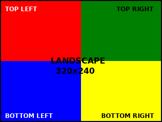
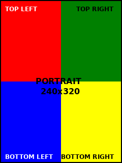

# Test Assets

This folder contains test images for verifying display rotation.

## Files

### Landscape Test Images

**landscape_test.png (320x240)**

- Visual reference showing correct landscape orientation
- Four colored quadrants: Red (TL), Green (TR), Blue (BL), Yellow (BR)
- Corner labels to verify orientation
- Use for pins-right and pins-left overlays

**landscape_test.raw (153600 bytes)**
- Raw RGB565 format (BGR order) for direct framebuffer write
- Same content as landscape_test.png
- Usage: `dd if=landscape_test.raw of=/dev/fb1 bs=153600 count=1`

---

### Portrait Test Images

**portrait_test.png (240x320)**

- Visual reference showing correct portrait orientation
- Four colored quadrants: Red (TL), Green (TR), Blue (BL), Yellow (BR)
- Corner labels to verify orientation
- Use for pins-bottom and pins-top overlays

**portrait_test.raw (153600 bytes)**
- Raw RGB565 format (BGR order) for direct framebuffer write
- Same content as portrait_test.png
- Usage: `dd if=portrait_test.raw of=/dev/fb1 bs=153600 count=1`

---

## Expected Results

When correctly oriented, you should see:
- **TOP LEFT** label in the top-left corner (red quadrant)
- **TOP RIGHT** label in the top-right corner (green quadrant)
- **BOTTOM LEFT** label in the bottom-left corner (blue quadrant)
- **BOTTOM RIGHT** label in the bottom-right corner (yellow quadrant)
- Center text readable and upright

**If labels appear in wrong corners or upside down, the overlay selection is incorrect.**

## Color Reference

- **Red quadrant:** Top-left
- **Green quadrant:** Top-right
- **Blue quadrant:** Bottom-left
- **Yellow quadrant:** Bottom-right

## Usage by Overlay

| Overlay | Test Image |
|---------|------------|
| ili9341-zjy240-pins-bottom | portrait_test.raw |
| ili9341-zjy240-pins-right | landscape_test.raw |
| ili9341-zjy240-pins-top | portrait_test.raw |
| ili9341-zjy240-pins-left | landscape_test.raw |
